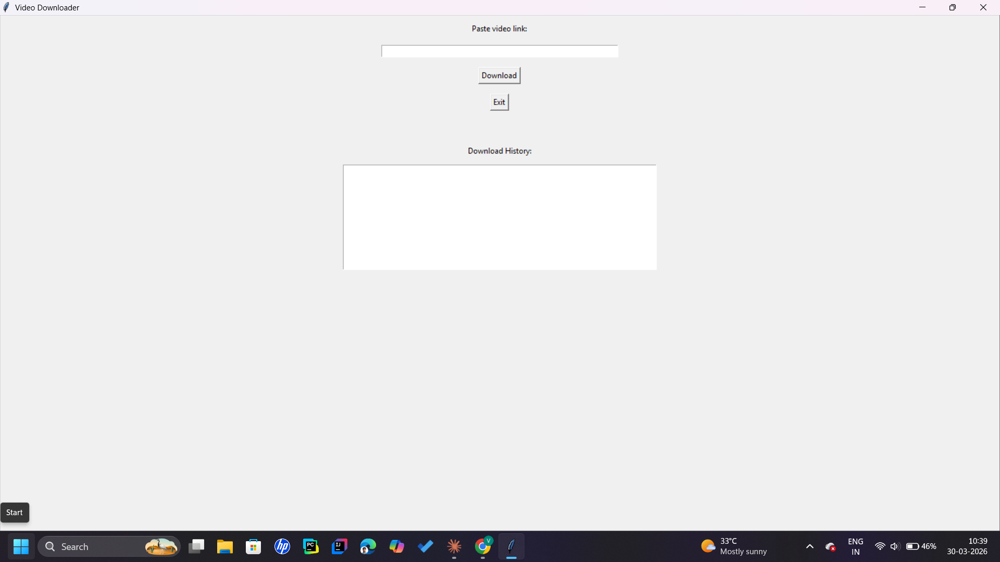

# YouTube Video Downloader

A simple and user-friendly Python desktop application built with **Tkinter** and **yt-dlp** to download YouTube videos with real-time progress tracking.
<p align="center">
  
</p>

## Features

- **Simple GUI**: Clean and intuitive interface built with Tkinter
- **Real-time Progress**: Displays download percentage as the video is being downloaded
- **Robust Error Handling**: Gracefully handles network errors and invalid URLs
- **MP4 Format**: Automatically downloads videos in best MP4 quality
- **Threading**: Non-blocking downloads prevent GUI freezing
- **Standalone Executable**: Can be packaged as a .exe file using PyInstaller

## Project Structure

```
Youtube_videos/
├── app.py          # Main application with GUI implementation
├── main.py         # Alternative entry point
├── main2.py        # Additional script variant
├── app.spec        # PyInstaller specification file
├── icon.ico        # Application icon
├── dist/           # Compiled executable files
└── build/          # Build artifacts
```

## Requirements

- Python 3.7 or higher
- `tkinter` (usually comes with Python)
- `yt-dlp` - YouTube downloader library

## Installation

1. Clone the repository:
   ```bash
   git clone https://github.com/VK-learner/Youtube_videos.git
   cd Youtube_videos
   ```

2. Install required dependencies:
   ```bash
   pip install yt-dlp
   ```

## Usage

Run the application:
```bash
python app.py
```

### How to Download

1. Paste a YouTube video URL in the text field
2. Click the **Download** button
3. Watch the real-time progress percentage
4. Videos are saved to `E:\youtube` directory (configurable in code)

## Configuration

You can customize the save location by modifying the `SAVE_FOLDER` variable in `app.py`:

```python
SAVE_FOLDER = r"E:\youtube"  # Change this path
```

## Creating a Standalone Executable

To package the application as a standalone .exe file:

```bash
pip install pyinstaller
pyinstaller app.spec
```

The executable will be generated in the `dist/` folder.

## Technical Details

- **Download Format**: Best quality MP4 format available
- **Progress Tracking**: Uses yt-dlp's progress_hook callback
- **Threading**: Downloads run in separate threads to prevent UI freezing
- **Error Messages**: User-friendly error dialogs for invalid inputs or failed downloads

## Future Enhancements

- [ ] Playlist support
- [ ] Audio-only download option
- [ ] Multiple format selections
- [ ] Download queue management
- [ ] Video thumbnail preview
- [ ] History of downloaded videos

## License

This project is open source and available under the MIT License.

## Author

**VK-learner** - Created as a simple utility for downloading YouTube videos

## Troubleshooting

**Issue**: "Module not found" error
- **Solution**: Make sure to install yt-dlp: `pip install yt-dlp`

**Issue**: Videos not downloading
- **Solution**: Check your internet connection and ensure the YouTube URL is valid

**Issue**: "Permission denied" when saving
- **Solution**: Ensure the save folder path exists and you have write permissions
